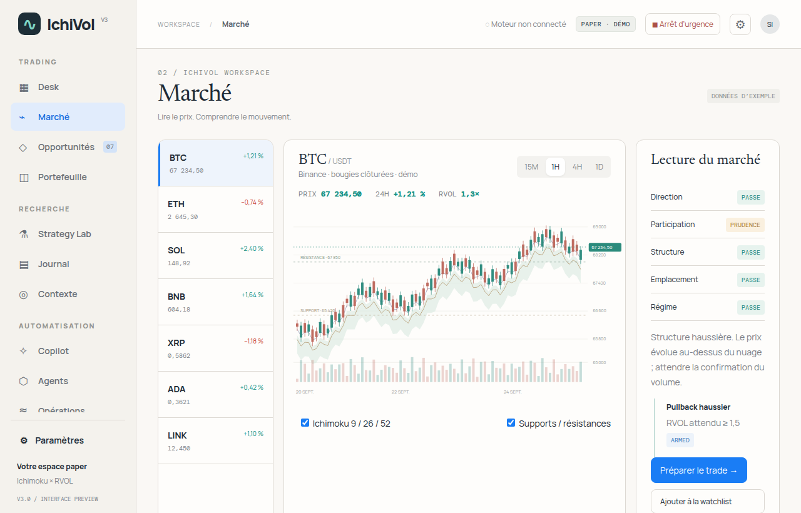
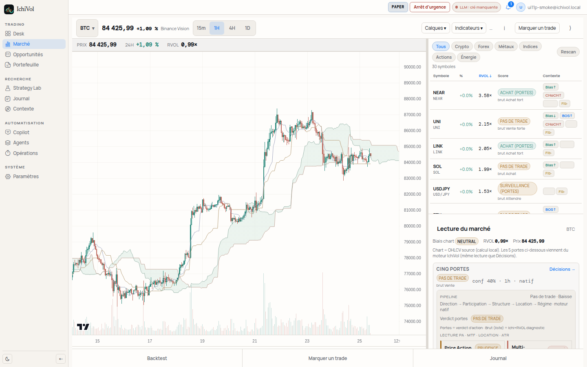
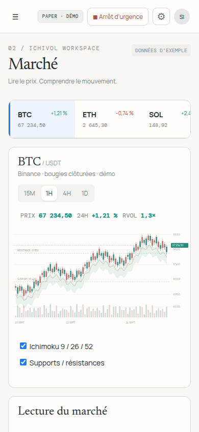
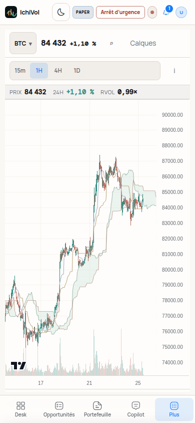
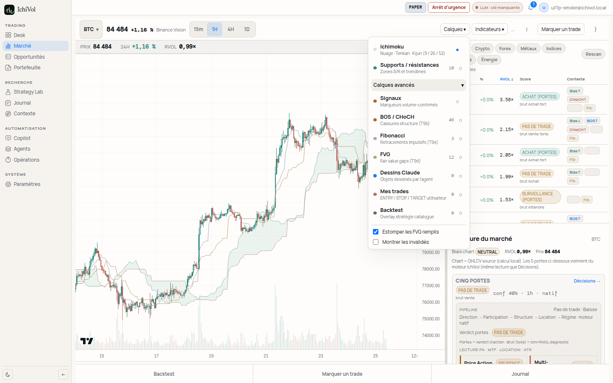
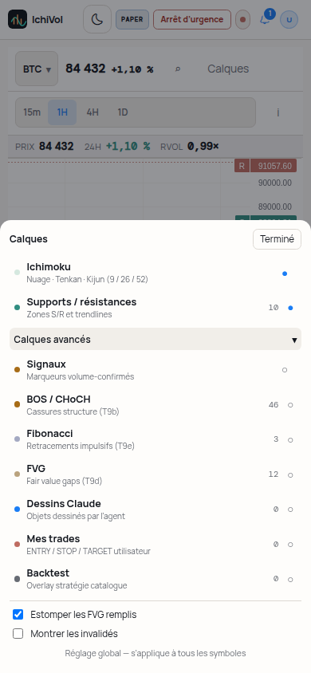
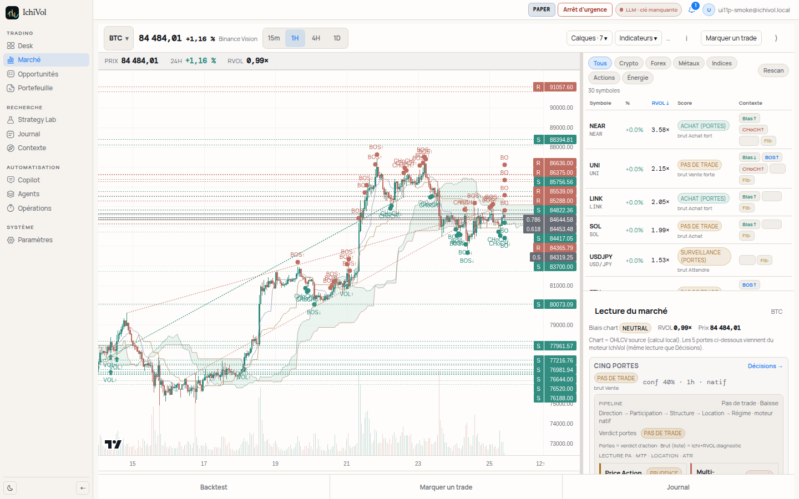
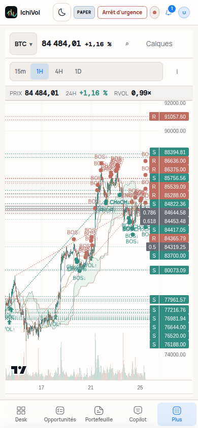

# UI-P4 complément — Graphique Marché conforme maquette

Branche : `cursor/ui-p4-market-chart-a2fe` · PR #107 (follow-up post-merge #103)

## Objectif

Rendre le graphique Marché lisible par défaut, aligné sur `design-reference/ichivol-workspace` (`candles()`), au lieu des ~12 calques actifs hérités.

## Changements code

| Zone | Détail |
|------|--------|
| `marketPrefs.ts` | `DEFAULT_LAYERS` = candles + volume + Ichimoku (TK + spans) ; reste off. Clé `ichivol.market.layers.v2` |
| `camap-tokens.css` / `chartColors.ts` | Bull `#318d80`, bear `#bf6c61`, cloud, grille ; volume alpha ~0,28 |
| `PriceChart.tsx` | Volume overlay bas, nuage AreaSeries, traits fins TK, pas de légendes sur le chart |
| `MarketLayersMenu.tsx` | Ichimoku + Supports/résistances, puis « Calques avancés » replié |
| `MarketPage.tsx` | Override temporaire `user_trades` / `backtest` (non persisté) |

## Comparaison côte à côte

### Desktop — maquette vs app (défaut BTC 1H)

| Maquette | App (défaut) |
|----------|--------------|
|  |  |

**Aligné** : bougies + volume semi-transparent en bas + nuage Ichimoku + Tenkan/Kijun fins, grille discrète, pas de BOS/CHoCH/signaux par défaut.

**Écarts acceptés** : la maquette SVG a des S/R démo cochés ; l’app les laisse **off** par défaut (interrupteur « Supports / résistances »). Volume maquette = barres SVG ; app = histogramme overlay LW charts.

### Mobile 390 — maquette vs app

| Maquette | App (défaut) |
|----------|--------------|
|  |  |

### Menu Calques (format maquette)

2 interrupteurs principaux + section **Calques avancés** (signaux, BOS/CHoCH, Fib, FVG, Claude, mes trades, backtest).

### Avec calques avancés (preuve densité)

| Desktop | Mobile |
|---------|--------|
|  |  |

`Calques · 7` — illisible volontairement : justifie les nouveaux défauts.

## Migration prefs

- Ancienne clé `ichivol.market.layers` **ignorée**.
- Nouvelle clé `ichivol.market.layers.v2` → appareils existants (ex. téléphone Samir) repartent sur les défauts maquette.
- Tout toggle ultérieur est re-persisté sur `v2`.

## Temp overlays

- **Marquer un trade** → force `user_trades` le temps du flux ; restore à l’annulation / validation.
- **Backtest overlay** → force `backtest` à l’activation ; restore au clear / changement symbole·TF.

## Artifacts

Aussi copiés sous `/opt/cursor/artifacts/ui-p4-chart/`.
